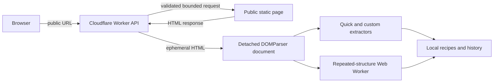

# Architecture

ScrapeStudio is a pnpm TypeScript monorepo for extracting structured data from supported public static web pages. The design keeps network access narrow, parsing local to the browser, and user data local by default.

## Repository layout

```text
apps/web                 React and Vite application
apps/api                 Hono Cloudflare Worker and Durable Object rate limiter
packages/extraction-core Detached-document extraction logic
packages/code-generator  Python and JavaScript starter-code templates
packages/shared          Shared limits and API contracts
tests                    Integration, end-to-end, and HTML fixtures
```

## Runtime boundaries



The Worker owns the remote-fetch boundary. It validates submitted and redirected URLs, applies time and response-size limits, accepts supported HTML content types, and enforces anonymous rate limits before returning a response. Remote markup is parsed only in a detached browser document and is never inserted into the live application DOM.

Detailed fetch controls are documented in [SECURE_FETCH.md](./SECURE_FETCH.md). Deployment configuration and operational controls are documented in [DEPLOYMENT.md](./DEPLOYMENT.md).

## Data and privacy

Fetched HTML is ephemeral: the server does not persist it, and result rows are not stored in server-side accounts or databases. Recipes and lightweight history remain in the browser's IndexedDB and can be exported by the user. The local data and export contract is documented in [LOCAL_DATA_AND_EXPORT.md](./LOCAL_DATA_AND_EXPORT.md).

Anonymous usage limits use a deployment-salted identity digest. Logs contain operational metadata such as request ID, hostname, outcome, duration, and byte length; they exclude submitted query strings, raw IP addresses, and HTML content.

## Frontend and extraction

The React application provides English and Persian routes with LTR/RTL document direction, persisted theme preferences, responsive result views, and keyboard-accessible controls. Framework-independent extraction functions handle tables, links, images, headings, metadata, and custom selectors. Repeated-structure analysis runs in a bounded Web Worker so it does not block ordinary extraction workflows.

## Deployment

The frontend is deployed to Cloudflare Pages and the API to a Cloudflare Worker. The committed Worker configuration is fail-closed: production origins and external fetching are enabled only by the protected manual deployment workflow after exact production values are validated. No deployment secrets are stored in the repository.
